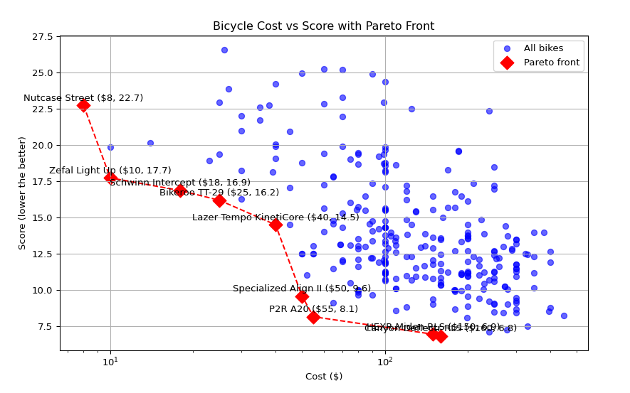

* pareto-plots

Various webscraping & visualization scripts that plots the pareto front of shopping items.

Mostly generated with chatgpt, then fixed by hand.

Chatgpt is nice for these mundane tasks.

+ helmets.py --- Scrapes [[https://www.helmet.beam.vt.edu/bicycle-helmet-ratings.html][Virginia Tech Helmet Rating website]] and plot the price vs. the score.
+ weightweenie.py --- TBD https://weightweenies.starbike.com/listings.php
+ rollingresistance.py --- TBD https://www.bicyclerollingresistance.com

